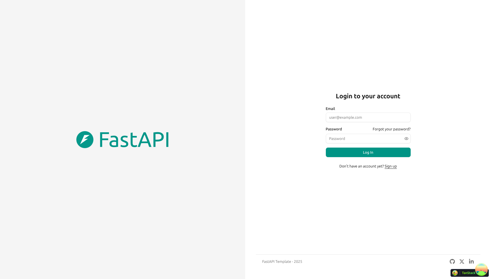
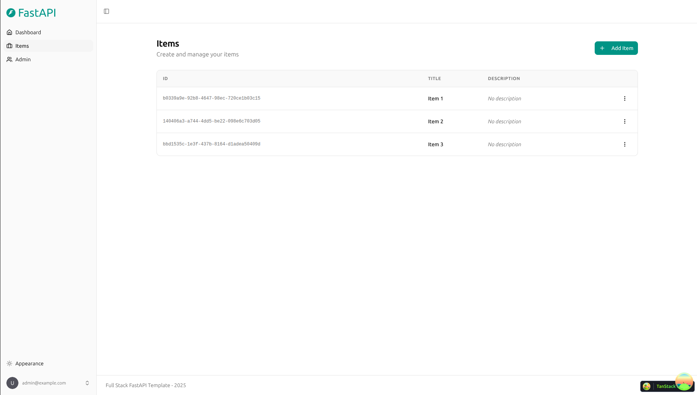

# Full Stack FastAPI Template
hola
<a href="https://github.com/fastapi/full-stack-fastapi-template/actions?query=workflow%3A%22Test+Docker+Compose%22" target="_blank"></a>
<a href="https://github.com/fastapi/full-stack-fastapi-template/actions?query=workflow%3A%22Test+Backend%22" target="_blank"></a>
<a href="https://coverage-badge.samuelcolvin.workers.dev/redirect/fastapi/full-stack-fastapi-template" target="_blank"></a>

## Technology Stack and Features

- ⚡ [**FastAPI**](https://fastapi.tiangolo.com) for the Python backend API.
  - 🧰 [SQLModel](https://sqlmodel.tiangolo.com) for the Python SQL database interactions (ORM).
  - 🔍 [Pydantic](https://docs.pydantic.dev), used by FastAPI, for the data validation and settings management.
  - 💾 [PostgreSQL](https://www.postgresql.org) as the SQL database.
- 🚀 [React](https://react.dev) for the frontend.
  - 💃 Using TypeScript, hooks, [Vite](https://vitejs.dev), and other parts of a modern frontend stack.
  - 🎨 [Tailwind CSS](https://tailwindcss.com) and [shadcn/ui](https://ui.shadcn.com) for the frontend components.
  - 🤖 An automatically generated frontend client.
  - 🧪 [Playwright](https://playwright.dev) for End-to-End testing.
  - 🦇 Dark mode support.
- 🐋 [Docker Compose](https://www.docker.com) for development and production.
- 🔒 Secure password hashing by default.
- 🔑 JWT (JSON Web Token) authentication.
- 📫 Email based password recovery.
- 📬 [Mailcatcher](https://mailcatcher.me) for local email testing during development.
- ✅ Tests with [Pytest](https://pytest.org).
- 📞 [Traefik](https://traefik.io) as a reverse proxy / load balancer.
- 🚢 Deployment instructions using Docker Compose, including how to set up a frontend Traefik proxy to handle automatic HTTPS certificates.
- 🏭 CI (continuous integration) and CD (continuous deployment) based on GitHub Actions.

### Dashboard Login

[](https://github.com/fastapi/full-stack-fastapi-template)

### Dashboard - Admin

[](https://github.com/fastapi/full-stack-fastapi-template)

### Dashboard - Items

[](https://github.com/fastapi/full-stack-fastapi-template)

### Dashboard - Dark Mode

[](https://github.com/fastapi/full-stack-fastapi-template)

### Interactive API Documentation

[](https://github.com/fastapi/full-stack-fastapi-template)

## How To Use It

You can **just fork or clone** this repository and use it as is.

✨ It just works. ✨

### How to Use a Private Repository

If you want to have a private repository, GitHub won't allow you to simply fork it as it doesn't allow changing the visibility of forks.

But you can do the following:

- Create a new GitHub repo, for example `my-full-stack`.
- Clone this repository manually, set the name with the name of the project you want to use, for example `my-full-stack`:

```bash
git clone git@github.com:fastapi/full-stack-fastapi-template.git my-full-stack
```

- Enter into the new directory:

```bash
cd my-full-stack
```

- Set the new origin to your new repository, copy it from the GitHub interface, for example:

```bash
git remote set-url origin git@github.com:octocat/my-full-stack.git
```

- Add this repo as another "remote" to allow you to get updates later:

```bash
git remote add upstream git@github.com:fastapi/full-stack-fastapi-template.git
```

- Push the code to your new repository:

```bash
git push -u origin master
```

### Update From the Original Template

After cloning the repository, and after doing changes, you might want to get the latest changes from this original template.

- Make sure you added the original repository as a remote, you can check it with:

```bash
git remote -v

origin    git@github.com:octocat/my-full-stack.git (fetch)
origin    git@github.com:octocat/my-full-stack.git (push)
upstream    git@github.com:fastapi/full-stack-fastapi-template.git (fetch)
upstream    git@github.com:fastapi/full-stack-fastapi-template.git (push)
```

- Pull the latest changes without merging:

```bash
git pull --no-commit upstream master
```

This will download the latest changes from this template without committing them, that way you can check everything is right before committing.

- If there are conflicts, solve them in your editor.

- Once you are done, commit the changes:

```bash
git merge --continue
```

### Configure

You can then update configs in the `.env` files to customize your configurations.

Before deploying it, make sure you change at least the values for:

- `SECRET_KEY`
- `FIRST_SUPERUSER_PASSWORD`
- `POSTGRES_PASSWORD`

You can (and should) pass these as environment variables from secrets.

Read the [deployment.md](./deployment.md) docs for more details.

### Generate Secret Keys

Some environment variables in the `.env` file have a default value of `changethis`.

You have to change them with a secret key, to generate secret keys you can run the following command:

```bash
python -c "import secrets; print(secrets.token_urlsafe(32))"
```

Copy the content and use that as password / secret key. And run that again to generate another secure key.

## How To Use It - Alternative With Copier

This repository also supports generating a new project using [Copier](https://copier.readthedocs.io).

It will copy all the files, ask you configuration questions, and update the `.env` files with your answers.

### Install Copier

You can install Copier with:

```bash
pip install copier
```

Or better, if you have [`pipx`](https://pipx.pypa.io/), you can run it with:

```bash
pipx install copier
```

**Note**: If you have `pipx`, installing copier is optional, you could run it directly.

### Generate a Project With Copier

Decide a name for your new project's directory, you will use it below. For example, `my-awesome-project`.

Go to the directory that will be the parent of your project, and run the command with your project's name:

```bash
copier copy https://github.com/fastapi/full-stack-fastapi-template my-awesome-project --trust
```

If you have `pipx` and you didn't install `copier`, you can run it directly:

```bash
pipx run copier copy https://github.com/fastapi/full-stack-fastapi-template my-awesome-project --trust
```

**Note** the `--trust` option is necessary to be able to execute a [post-creation script](https://github.com/fastapi/full-stack-fastapi-template/blob/master/.copier/update_dotenv.py) that updates your `.env` files.

### Input Variables

Copier will ask you for some data, you might want to have at hand before generating the project.

But don't worry, you can just update any of that in the `.env` files afterwards.

The input variables, with their default values (some auto generated) are:

- `project_name`: (default: `"FastAPI Project"`) The name of the project, shown to API users (in .env).
- `stack_name`: (default: `"fastapi-project"`) The name of the stack used for Docker Compose labels and project name (no spaces, no periods) (in .env).
- `secret_key`: (default: `"changethis"`) The secret key for the project, used for security, stored in .env, you can generate one with the method above.
- `first_superuser`: (default: `"admin@example.com"`) The email of the first superuser (in .env).
- `first_superuser_password`: (default: `"changethis"`) The password of the first superuser (in .env).
- `smtp_host`: (default: "") The SMTP server host to send emails, you can set it later in .env.
- `smtp_user`: (default: "") The SMTP server user to send emails, you can set it later in .env.
- `smtp_password`: (default: "") The SMTP server password to send emails, you can set it later in .env.
- `emails_from_email`: (default: `"info@example.com"`) The email account to send emails from, you can set it later in .env.
- `postgres_password`: (default: `"changethis"`) The password for the PostgreSQL database, stored in .env, you can generate one with the method above.
- `sentry_dsn`: (default: "") The DSN for Sentry, if you are using it, you can set it later in .env.

## Backend Development

Backend docs: [backend/README.md](./backend/README.md).

## Frontend Development

Frontend docs: [frontend/README.md](./frontend/README.md).

## Deployment

Deployment docs: [deployment.md](./deployment.md).

## Development Log and Policies

This section is used to capture the current work and the conventions we are following in this project.

### Current work in progress

- Frontend: updated the sidebar menu in `frontend/src/components/Sidebar/AppSidebar.tsx` and `frontend/src/components/Sidebar/Main.tsx`.
  - `Dashboard` remains the only top-level base item.
- Preservation policy: do not change existing menu routes such as `/general/marcas` unless explicitly requested.
- Code deletion policy: do not remove or refactor application code without prior authorization.
- New frontend modules should be added under the existing menu structure rather than changing current menu paths.

  - `General`, `Compras`, and `Ventas` were added with collapsible submenu items.
  - `Admin` remains available for superusers.
  - Added "Jerarquía" menu item in General section pointing to `/hierarchy` route.
- Backend: schema changes are tracked via Alembic migrations in `backend/app/alembic/versions/`.
  - Added `User.id_rol` and linked it to `role.id` with a foreign key.
  - Added the `role` table with `id`, `name`, and `is_active`.
  - Added `categories` table (UUID id, nombre VARCHAR(100), is_active BOOLEAN, timestamps).
  - Added `sections` table (UUID id, nombre VARCHAR(100), category_id FK, is_active BOOLEAN, timestamps).
  - Added `sub_sections` table (UUID id, nombre VARCHAR(150), section_id FK, is_active BOOLEAN, timestamps).
  - Added SQLModel classes for `Category`, `Section`, and `SubSection` in `backend/app/models.py`.
  - Added CRUD functions for categories, sections, and sub_sections in `backend/app/crud.py`.
  - Added API routes for categories in `backend/app/api/routes/categories.py` with prefix `/categories` and tags `["categories"]`.
  - Added API routes for sections in `backend/app/api/routes/sections.py` with prefix `/sections` and tags `["sections"]`.
  - Added API routes for sub-sections in `backend/app/api/routes/sub_sections.py` with prefix `/sub-sections` and tags `["sub-sections"]`.
- Frontend components: created hierarchical table component in `frontend/src/components/Hierarchy/`.
  - `HierarchyManager.tsx`: Main component with table structure and data fetching.
  - `CategoryRow.tsx`: Expandable category rows with section management.
  - `SectionRow.tsx`: Expandable section rows with sub-section management.
  - `SubSectionRow.tsx`: Sub-section display rows.
  - `AddCategory.tsx`, `AddSection.tsx`, `AddSubSection.tsx`: Form dialogs for creating new items.
  - Added route `/hierarchy` in `frontend/src/routes/_layout/hierarchy.tsx`.
- Docker/dev workflow: local development is working with `docker compose up --build`.

### Policies and conventions

- Use the root `README.md` to keep a short, high-level project log for future collaborators and AI reviewers.
- Keep meaningful Git commit messages for every change; use the README log for quick context.
- Use Alembic for all database schema changes instead of altering the database manually.
- Prefer rebuilding the Docker container when code changes affect backend or Docker-managed files.
- Keep frontend route/menu definitions in `frontend/src/components/Sidebar/` and backend schema in `backend/app/`.
- Do not delete code without explicit authorization.
- Preserve existing sidebar routes such as `general/marcas` and other menu items unless a direct request is made to modify them.
- If a runtime or compile error appears, capture the exact command and output in the log.
- When a helper is defined with `this: (msg: string) => void`, invoke it with `.bind(showErrorToast)` before passing it as a callback, as used in `src/components/Hierarchy/AddCategory.tsx`. This is the correct pattern for new components.

### Open issue: duplicate table names and schema mismatch
- There is a naming mismatch between model/table names and generated Alembic migrations for the hierarchy entities.
- Current backend schema includes plural tables: `categories`, `sections`, `sub_sections`.
- At the same time, the app has singular model/table references: `category`, `section`, `subsection`.
- This likely happened because the first tables were created from the earlier model state/SQLModel defaults, while later migrations were generated with plural table names.
  - `Category` class currently maps to a singular table name by SQLModel default, but the migration created `categories`.
  - `Section` model references `foreign_key="category.id"` instead of `categories.id`, so it is inconsistent with the current `sections`/`categories` schema.
  - `SubSection` model references `foreign_key="section.id"` instead of `sections.id`, causing the same mismatch for sub-sections.
- Result: one set of tables is used by the app models and another by the Alembic migrations, which can create duplicate or orphaned tables.
- Fix path: normalize names consistently, use explicit table names or correct foreign key references, then regenerate/correct Alembic migrations before applying.

### Recommended tracking tools

- `README.md` for quick context and current project state.
- `CHANGELOG.md` for a more formal historical record of releases and major changes.
- Git history and branches for detailed change context.
- Optionally, a dedicated `docs/` folder or `project-notes.md` for longer design decisions.

## Development

General development docs: [development.md](./development.md).

This includes using Docker Compose, custom local domains, `.env` configurations, etc.

## Release Notes

Check the file [release-notes.md](./release-notes.md).

## License

The Full Stack FastAPI Template is licensed under the terms of the MIT license.
